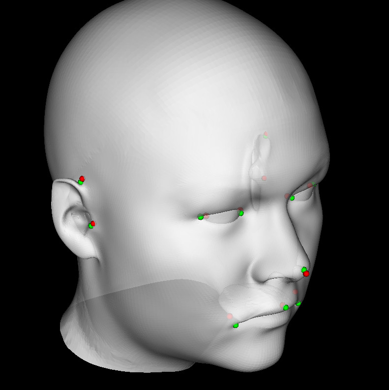
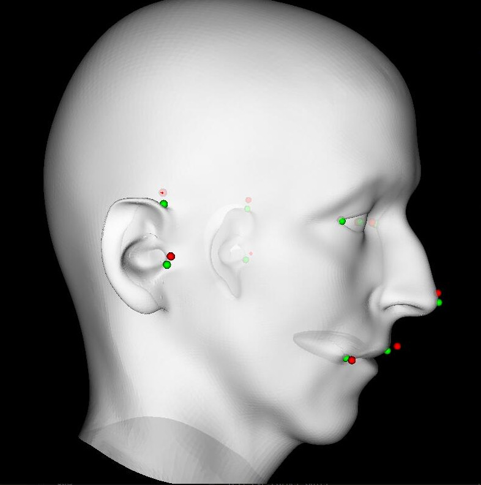

# Anatomical landmarking of artificially generated head scans

Experiments with O-CNN for automatic landmarking of data (not provided) consisting of heads (triangulated surfaces) and corresponding landmarks sythesized from the [Basel Face Model 2019](https://faces.dmi.unibas.ch/bfm/bfm2019.html).

## Current perfomance

Example outcome of a using an 5 level representation of the heads and the octree network architecture is shown below. The mean deviation on the test and training set flattens out at about 0.02 of the bounding box size for the current setup, which is comparable to the octree size of the leaf octants $2^{-5}=0.03125$

## TODO
- [ ] Rotate data randomly to get a more challenging problem.
- [ ] Experiment with point to octree conversion and augmentation parameters.
- [ ] Try with higher level octree
